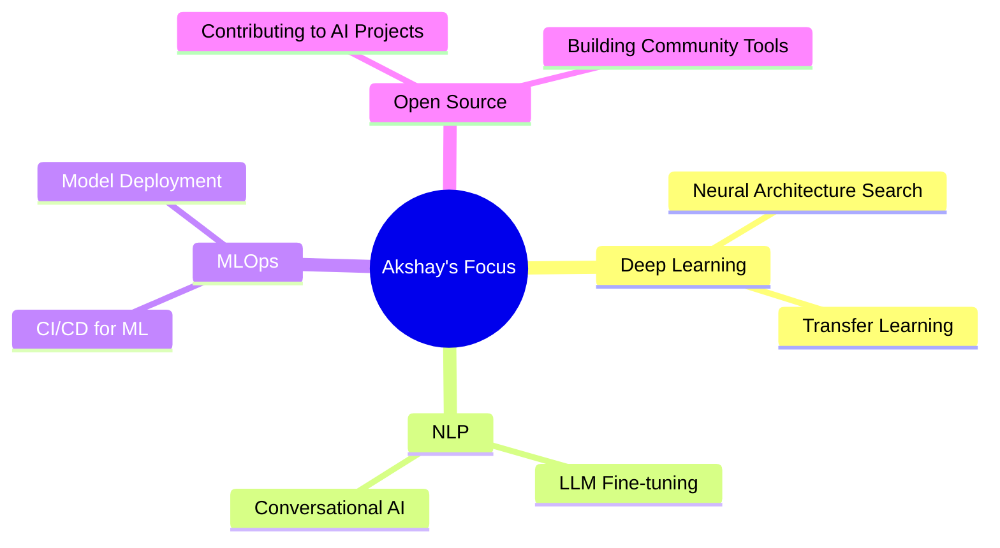

<!-- HEADER -->
<p align="center">
  
</p>

<h1 align="center">Akshay Shekade</h1>

<p align="center">
  <a href="https://akshayshekade.netlify.app/" target="_blank">
    
  </a>
  <a href="https://www.linkedin.com/in/akshayshekade/" target="_blank">
    
  </a>
  <a href="mailto:akshayshekade757@gmail.com" target="_blank">
    
  </a>
  <a href="https://www.instagram.com/_akshuu_1312/" target="_blank">
    
  </a>
</p>

<!-- ABOUT ME SECTION -->
<h2 align="center">🚀 Data Scientist | ML Engineer | AI Enthusiast</h2>

```python
class DataScientist:
    def __init__(self):
        self.name = "Akshay Shekade"
        self.education = "B.Tech from Pune University"
        self.interests = ["Machine Learning", "AI", "Data Science", "Open Source"]
        self.learning = ["Deep Learning", "NLP", "Computer Vision"]
        
    def say_hi(self):
        print("Thanks for visiting my GitHub! Let's collaborate and build something amazing.")

me = DataScientist()
me.say_hi()
```

<!-- SKILLS SECTION -->
<h2 align="center">💻 Tech Arsenal</h2>

<table align="center">
  <tr>
    <td align="center" width="96">
      <a href="#">
        
      </a>
      <br>Python
    </td>
    <td align="center" width="96">
      <a href="#">
        
      </a>
      <br>MySQL
    </td>
    <td align="center" width="96">
      <a href="#">
        
      </a>
      <br>AWS
    </td>
    <td align="center" width="96">
      <a href="#">
        
      </a>
      <br>TensorFlow
    </td>
    <td align="center" width="96">
      <a href="#">
        
      </a>
      <br>PyTorch
    </td>
    <td align="center" width="96">
      <a href="#">
        
      </a>
      <br>MongoDB
    </td>
  </tr>
  <tr>
    <td align="center" width="96">
      <a href="#">
        
      </a>
      <br>Django
    </td>
    <td align="center" width="96">
      <a href="#">
        
      </a>
      <br>Streamlit
    </td>
    <td align="center" width="96">
      <a href="#">
        
      </a>
      <br>OpenCV
    </td>
    <td align="center" width="96">
      <a href="#">
        
      </a>
      <br>Azure
    </td>
    <td align="center" width="96">
      <a href="#">
        
      </a>
      <br>VS Code
    </td>
    <td align="center" width="96">
      <a href="#">
        
      </a>
      <br>Git
    </td>
  </tr>
</table>

<!-- AI TOOLS SECTION -->
<h2 align="center">🤖 AI Toolkit</h2>

<p align="center">
  
  
  
  
  
  
</p>

<!-- GITHUB STATS -->
<h2 align="center">📊 GitHub Analytics</h2>

<p align="center">
  <a href="https://github.com/AkshayShekade">
    
    
  </a>
</p>

<p align="center">
  
</p>

<!-- EXPERIENCE SECTION -->
<h2 align="center">🧠 AI Experience</h2>

<p align="center">
  <table align="center">
    <tr>
      <td>
        <strong>🔹 Natural Language Processing</strong>
        <ul>
          <li>Transformer architectures implementation</li>
          <li>Text classification & sentiment analysis</li>
          <li>Large language model fine-tuning</li>
        </ul>
      </td>
      <td>
        <strong>🔹 Computer Vision</strong>
        <ul>
          <li>Object detection & image segmentation</li>
          <li>CNN architecture design</li>
          <li>Video analysis applications</li>
        </ul>
      </td>
    </tr>
    <tr>
      <td>
        <strong>🔹 Data Engineering</strong>
        <ul>
          <li>ETL pipeline development</li>
          <li>Big data processing</li>
          <li>Data visualization dashboards</li>
        </ul>
      </td>
      <td>
        <strong>🔹 Machine Learning Systems</strong>
        <ul>
          <li>Recommender system design</li>
          <li>Anomaly detection</li>
          <li>Reinforcement learning applications</li>
        </ul>
      </td>
    </tr>
  </table>
</p>

<!-- FOOTER -->
<h2 align="center">🔍 Current Focus</h2>

<div align="center">
  


</div>

<br>

<p align="center">
  
</p>

<p align="center">
  <i>"The goal is to turn data into information, and information into insight." – Carly Fiorina</i>
</p>
